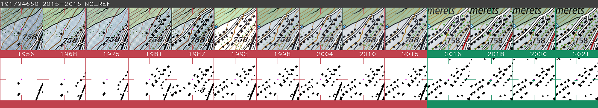

# RegBL Completion
Automated building construction year detection using historical Swiss maps

This project is a python translation of https://github.com/swiss-territorial-data-lab/regbl-poc by the [Swiss Territorial Data Lab](https://www.stdl.ch/).
We changed some functionalities, especially to make the code faster and more modular, and detect smaller buildings.

# Requirements / Installation
1. Install the latest version of Python
2. Install the dependencies listed in `requirements.txt`, you can use the command `pip install -r requirements.txt`

# Data requirements

## Maps
- The map should be divided into tiles. Each tile must be in a .tif format and come with its attached .twf having the same name.
- The map tiles must have their name ending with the tile ID, the year and a final number separated by underscores, in following the format :`tile_name_ID_year_number.tif`. For example : `SMR25_LV95_KREL_1123_2020_1.tif` for a tile of ID 1123 in year 2020.

## Input file
The input file lists all the building to detect. 
It is a CSV file with at least the following columns (other columns are ignored) :
- EGID : EGID of the building 
- GKODE : Easting coordinate of the building
- GKODN : Northing coordinate of the building

# Setup
Complete the configuration file `parameters.py` following your needs. 
Here are the main parameters and their meaning:
  - `INPUT_FOLDERS` : List of folders in which the map tiles (.tif files) and their georeferencing (.tfw) are located.
  - `TILE_TO_PROCESS` : List of tiles to process. Process and generate the output of all these tiles one by one.
  - `DATA_LOCATION` : Path to the input file (CSV file containing the columns EGID, GKODE, GKODN)
  - `GROUND_TRUTH` : CSV file similar to the file in DATA_LOCATION, but with the added column "GBAUJ" that indicates the building construction year.
  - `OUTPUT_FOLDER` : folder where the output CSV file and the tracking images will be generated. The script will create one folder per tiles to process in this folder.

# Running the program

The run the program, run the main.py script, with the command `python main.py` or `python3 main.py`
The script go through 7 steps for each tile :
1. Initialization : Parse the .tif and .tfw files, resize them and copy them to the processing folder 
2. Segmentation : Convert full-color maps to black and white images, keeping only the buildings and other large black structures
3. Bootstrapping : Extract information from the input CSV file and store them in the processing folder structure
4. Detection : Infer for each building 
  - If it is present or not on each map
  - The position, if found
  - The area if found
  - If the shape changed significantly from the previous year
5. Deduction : Read the output from the previous step and outputs a construction period. Also detects if the building significantly changed shape or if the detection oscillates between years. Outputs in the output folder a CSV file with all the results.
6. Test : If a ground truth is provided, compare the results with it
7. Track : Generates, in the output folder, for all buildings, an image that displays map extracts with detection results. Useful for manual errors inspections.

# Output

The script creates in `OUTPUT_FOLDER` one folder per tile. A tile's folder contains a file `result.csv` with the following columns :
- EGID : ID of the building
- LAST_NOT_DETECTED : Last year when the building was not found.
- FIRST_DETECTED : First year when the building was present on the map
- NOTE : Additional information about the detection. Currently, there are two notes :
  - OSCILLATE : The detection oscillated between found and not found. This often indicates that the building was not present on all the maps, or that the detection failed.
  - SHAPE_CHANGED : The ground area detected for the building significantly changed after the building was constructed. This often indicates that a building was modified / rebuild or that the detection failed.

From our test, we recommend discarding the buildings with a OSCILLATE or SHAPE_CHANGED note, as these are generally errors or edge cases where a construction period is ambiguous.

The script also generates one image per building that displays the detection results in the following format :

